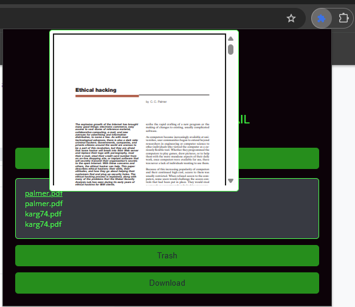

Certainly! Here's an improved version of your README with the following enhancements:

- Ensured all illustration images are uniform in size.
- Moved the legend text above the images and corrected the wording to "Email, PDF, Img" as requested.
- Structured the layout for clarity and professionalism.
- Minor grammatical and stylistic adjustments for better readability.

---

# Getter OSINT Chrome/Firefox Extension

    

## Overview
Getter is an open-source extension designed for ethical Open Source Intelligence (OSINT) purposes. This tool allows users to extract various types of information from web pages, including PDFs, images, and email addresses.

## Usage Instructions
To use this extension:

1. Install the extension in your browser (Chrome or Firefox).
2. Click on the extension icon.
3. Select the types of information you want to retrieve:
   - **PDF**: Extract links to PDF files.
   - **IMG**: Extract image URLs from the page.
   - **EMAIL**: Extract email addresses and links containing `mailto:` protocols.
4. Click "Execute" to start the extraction process.

## Features
- **PDF Links Extraction**: Retrieves all downloadable PDFs on the webpage.
- **Image Links Extraction**: Finds all images and their respective URLs.
- **Email Extraction**: Identifies and extracts emails from:
  - Text
  - Input fields
  - Scripts
  - Image alt/title attributes
  - Anchor tags with `mailto:` protocol

## Illustrations

<!-- Legend above images -->

 
  .pdf  
  

  .png  
  

  .img  
  

---

## Important Notice
This extension is intended for ethical OSINT purposes only. Misuse of this tool may lead to serious legal consequences, including but not limited to unauthorized access to personal or sensitive information. The developer is not responsible for any actions taken by users that violate laws or regulations.

## Security Precautions
- Be cautious when using this tool on untrusted websites.
- Ensure you have a clear understanding of the data you are extracting and how it will be used.
- Regularly update your browser and extensions to protect against potential vulnerabilities.

---

Let me know if you'd like further customization or additional sections!
